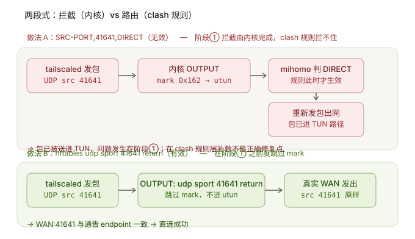

本文记录的是一个**特定网络环境下的实测问题**：OpenWrt / ImmortalWrt 软路由、OpenClash 开启「代理路由器自身流量」、Tailscale 作为 Exit Node，远端设备与软路由通过Tailscale连接，期望直连并通过OpenClash代理出口流量。


> 设备：ImmortalWrt 旁路由 `192.168.x.2（单 LAN 口，无 WAN）+ OpenClash（开启「代理路由器自身流量」）+ Tailscale（`fw_mode=nftables`，`advertise_exit_node=1`）
>   
> 上游：主路由 `192.168.x.1`（PPPoE + 出口 NAT，已映射 UDP 41641 → `192.168.x.2:41641`）
>
> 故障状态：远端设备与软路由无法Tailscale Direct直连，通过Tailscale  DERP 中继，出口流量可以被OpenClash代理
> 
> 修复效果：通过一行 nftables 规则修复，远端设备与软路由Tailscale Direct直连，且 Exit Node 出网流量仍经 OpenClash 代理。

本方案由AI完成，本文也是在AI辅助下编写。原创方案，转载请注明出处，谢谢。

---
## 1. 问题背景

我的网络结构如下（旁路由单 LAN，无独立 WAN）：

```text
Windows PC / Android（100.x.x.x）
    │
    │ 远端设备经 Tailscale 连接
    ▼
主路由
192.168.x.1  (PPPoE + 出口 NAT + 端口映射41641)
    │
    │ LAN
    ▼
ImmortalWrt 旁路由
192.168.x.2
    ├── OpenClash（开启「代理路由器自身流量」）
    └── Tailscale（Exit Node）
```

我的需求：

1. **Tailscale 要 Direct** —— 远端设备与旁路由之间能自动建立直连 UDP，不要走 DERP 中继。
2. **局域网设备和远端设备的出口流量被 OpenClash代理** —— 远端设备选旁路由为 Exit Node 时，出网流量必须经过 OpenClash 代理，这是旁路由存在的意义。
3. **重启后规则不能丢** —— 软路由、 `openclash` 与 `firewall`重启后，自动稳定直连，不能再次手动修复。

因此**不能关闭「代理路由器自身流量」**，否则 Exit Node 就不走代理了。
此外，OpenClash 自定义规则里放行 41641 端口、放行 `100.64.0.0/10`、放行Tailscale 域名等方法实测无效。

---

## 2. 故障现象

远端设备与软路由无法Tailscale Direct直连，通过Tailscale  DERP 中继：

```text
tailscale status 显示：
  100.x.x.x  pc-20260625  windows  active; relay "sin"; tx 258804 rx 0

tailscale ping 全部回：
  via DERP(sin)，且抖动极大（817ms / 2.489s / 4.808s）
  末尾报 direct connection not established
```

实测重启OpenClash或防火墙，Tailscale可以Direct直连成功，但远端设备离线后过一段时间重新连接仍然为中继状态，想要直连就需要再次重启。

---

## 3. 排查过程

### 3.1 先排除公网与 NAT 问题

```text
tailscale netcheck 关键输出：
UDP: true
IPv4: yes, 171.xx.xx.xx:2xxx8
MappingVariesByDestIP: false
PortMapping:
```

判读：

- `UDP: true` + `IPv4: yes` → UDP 可用、公网端点可见，排除 ISP 封 UDP、排除 Tailscale 栈异常。
- `MappingVariesByDestIP: false` → 表示本次 STUN 探测中，公网映射没有随目标地址变化，是有利于 UDP 打洞的信号；但它本身不足以对 NAT 做完整分类，也不能单独据此证明一定不是某种 symmetric NAT。
- 端点显示 `171.xx.xx.xx:2xxx8，外部端口与本机监听的 41641` 不同。`netcheck` 看到的是公网侧可见的 `IP:port`，外部端口与本地监听端口不同在 NAT 环境中属正常可能，本身并不是故障；本次实测也证明，在当前 NAT 环境下无需修改主路由，修复仍能建立 Direct。


### 3.2 确认 41641 到底是谁在监听

```bash
ss -lunp | grep 41641
```

```text
UNCONN 0 0 0.0.0.0:41641  0.0.0.0:*  users:(("tailscaled",pid=32702,fd=13))
UNCONN 0 0       *:41641        *:*  users:(("tailscaled",pid=32702,fd=12))
```

监听正常，排除Tailscale 没监听 41641。

### 3.3 排查包的路径：发现 OpenClash 正在处理本机 OUTPUT

```bash
nft list ruleset | grep -n -E '41641|openclash_mangle_output|tproxy|tailscale'
```

```text
1766:  meta nfproto ipv4 counter packets 180228 bytes 206585569 jump openclash_mangle_output
22:    udp dport 41641 counter packets 15636 bytes 3001698 accept
57:    udp dport 41641 counter packets 0 bytes 0 accept
```

- `jump openclash_mangle_output` 挂在 IPv4 **OUTPUT** 上 → 本机产生的流量会进 OpenClash 的 mangle 链。
- 已有的 `udp dport 41641 accept` 命中 **15636 包**，说明入站 41641 是通的——**但它是入站方向**。Tailscale 主动出站的 direct UDP 是 **`sport 41641`**，不是 `dport 41641`。这条规则保护不到出站。

同样的条件 `udp dport 41641` 在同一份输出里出现了两次，对比很说明问题：

| 所在链         | 规则                       | 命中          |
| ----------- | ------------------------ | ----------- |
| 入站链（第 22 行） | `udp dport 41641 accept` | **15636 包** |
| 出站链（第 57 行） | `udp dport 41641 accept` | **0 包**     |

入站命中、出站未命中。原因就是出站包的目的端口是对端的随机端口（`20568` 之类），只有**源端口**才是 `41641`。

### 3.4 搞清楚 sport 与 dport

`tailscaled` 在本机监听 UDP `41641`。对同一监听端口而言，入站包匹配 `dport 41641`，本机发往对端的包则匹配 `sport 41641`——这里真正重要的是**方向决定 `sport`/`dport` 角色**，而不是具体用了几个 socket：

| 方向          | 包长什么样                                           | 该匹配什么             |
| ----------- | ----------------------------------------------- | ----------------- |
| 入站（远端 → 本机） | `src 117.x.x.x:2xxx8` → `dst 192.168.x.2:41641` | `udp dport 41641` |
| 出站（本机 → 远端） | `src 192.168.x.2:41641` → `dst 117.x.x.x:2xxx8` | `udp sport 41641` |

同一个端口，在两个方向上一个是 `dport`、一个是 `sport`。这就是`dport` 规则明明配了却没用的全部原因。本次修复解决的就是出站这半个方向。

#### 补充：入站方向为什么本来就是通的？

入站通，跟 `openclash_mangle_output` 毫无关系，有两个独立原因。

**原因一：路径根本不同，入站压根不经过那条链。**

`openclash_mangle_output` 挂在 **OUTPUT** hook 上，只处理**本机自己产生**的包。远端发进来的包走的是另一条路：

```text
入站：远端 → PREROUTING → INPUT → tailscaled
                                    ↑ 不经过 OUTPUT，碰不到 openclash_mangle_output

出站：tailscaled → OUTPUT → mangle_output → openclash_mangle_output → mark 0x162
```

OpenClash 的“代理路由器自身流量”作用范围本来就只有**路由器自己发出**的流量，入站天然不在它的射程内。

**原因二：真正起作用的是 tailscaled 自己装的规则。**

第 22 行 `udp dport 41641 ... 15636 包` 这部分规则，从所在区域及其周边的 `tailscale0`、`0x400` 等特征看，与 Tailscale 自己维护的 nftables 规则一致；Tailscale 文档也说明，在 `netfilterMode=on` 下会自行创建并管理 firewall rules。判断依据：

- **没有 `comment "!fw4: ..."` 注释** —— fw4 生成的规则一律带这种注释；
- **带 `counter`**，且周围规则里有 `100.x.x.0/23`、`meta mark & 0xffff04ff | 0x400` 这些 **Tailscale 私有特征**（`0x400` 是 tailscaled 自己的 mark 位）。

可用 `nft list table inet tailscale` 确认这部分规则由 Tailscale 管理。

**那入站通了，为什么还是直连不了？** 因为 NAT 打洞是**双向**的，缺一半就不成立：本机必须**主动**往外发包，主路由上才会建立 NAT 映射；对端收到后朝这个映射**回包**，握手才完成。现在的情况是第二半（入站）一直畅通，但第一半（出站）被 `mark 0x162` 送进了 `utun`。对端按原 endpoint 回包，本机对不上号 → 握手失败 → 退回 DERP。**结论：「入站通」是「能直连」的必要不充分条件。**

### 3.5 用 ip rule 排查 链内容

排查链内容：

```bash
nft -a list chain inet fw4 openclash_mangle_output
```

```text
chain openclash_mangle_output { # handle 529
        meta skgid 65534 counter ... return                                    # handle 530
        ip daddr @localnetwork counter ... return                              # handle 531
        ct direction reply counter ... return                                  # handle 532
        meta l4proto udp ip daddr 198.18.0.0/16 meta mark set 0x162 ...        # handle 533
        ip daddr @china_ip_route ip daddr != @china_ip_route_pass ... return   # handle 534
        ip protocol icmp icmp type echo-request meta mark set 0x162 ...        # handle 535
        meta l4proto udp meta mark set 0x00000162 counter packets 4881 ...     # handle 536  ← 元凶
}
```

末尾这条 `meta l4proto udp meta mark set 0x162` 等于：**凡是走到这里、前面没 return 的本机 UDP，一律打上 fwmark `0x162`。**

确认 tailscaled 绕不过前面的 return：

```bash
cat /proc/32702/status | grep -E 'Uid|Gid'
# Uid:  0  0  0  0
# Gid:  0  0  0  0
```

tailscaled 以 **root(0:0)** 运行 → 链首的 `meta skgid 65534 return` 保护不到它；目标也不是 `@localnetwork` / `@china_ip_route`，方向也不是 reply。必然一路走到 `mark 0x162`。

确认 `0x162` 最终去了哪里？

```bash
ip rule
# 1888:   from all fwmark 0x162 lookup 354

ip route show table all
# default dev utun table 354 scope link
```

`mark 0x162 → ip rule 1888 → table 354 → default dev utun` → **utun 就是 OpenClash 的 TUN**，mark 0x162的流量被OpenClash代理。
至此，故障原因已排查出来，Tailscale出站方向的`udp sport 41641`流量未被保护，进入了OpenClash utun代理。下面继续复查确认。

### 3.6 用计数器确认

在链尾部临时加一条纯计数规则：

```bash
nft add rule inet fw4 openclash_mangle_output udp sport 41641 counter
tailscale ping 100.x.x.x
nft -a list chain inet fw4 openclash_mangle_output
```

```text
meta l4proto udp meta mark set 0x00000162 counter packets 5012 ...   # handle 536
udp sport 41641 counter packets 100 bytes 6800                       # handle 556  ← 新增
```

这 100 个包是在 `mark 0x162` 之后才被计数的，也就是说它们到达计数规则之前已经被打了 mark。可以确认：Tailscale 的 41641 出站 UDP 确实被 OpenClash 的 UDP 全捕获规则处理了。

### 3.7 A/B 测试（关键对照）

在链**最前面**插入 return，看效果是否立竿见影：

```bash
nft insert rule inet fw4 openclash_mangle_output udp sport 41641 counter return
tailscale ping 100.x.x.x
```

```text
pong from wxg-magic6 (100.x.x.x) via DERP(sin) in 3.453s
pong from wxg-magic6 (100.x.x.x) via DERP(sin) in 2.489s
pong from wxg-magic6 (100.x.x.x) via DERP(sin) in 2.604s
pong from wxg-magic6 (100.x.x.x) via DERP(sin) in 1.396s
pong from wxg-magic6 (100.x.x.x) via 117.x.x.x:2xxx8 in 45ms   ← 直连建立
```

插入return后直连建立，用3.6章节的计数器确认规则命中 3150 包，因此插入return规则有效解决问题，DERP 中继立即变Direct 直连。

---

## 4. 最终根因

```text
tailscaled (root, UDP sport 41641)
   ↓
Linux OUTPUT
   ↓
fw4: mangle_output (priority mangle = -150)
   ↓
openclash_mangle_output
   ├─ meta skgid 65534 return      ✗ tailscaled 是 root(0:0)
   ├─ ip daddr @localnetwork       ✗ 目标是公网 peer
   ├─ ct direction reply           ✗ 是主动出站
   ├─ ip daddr @china_ip_route     ✗ 目标多在境外
   ↓
meta l4proto udp meta mark set 0x00000162     ← 全捕获
   ↓
ip rule 1888: fwmark 0x162 lookup 354
   ↓
table 354: default dev utun
   ↓
OpenClash TUN 路径
   ↓
Direct 建立失败（在链首加 return 跳过打标后，Direct 立即恢复，故可确认该路径为原因）
   ↓
回退 DERP(relay "sin")
```

OpenClash「代理路由器自身流量」在 `openclash_mangle_output` 链末尾有一条**本机 UDP 全捕获**规则（`meta l4proto udp meta mark set 0x162`），而 tailscaled 以 root 运行、前面的绕过条件全不命中；Tailscale 自己维护的 nftables 规则只配了 `udp dport 41641`（入站方向），**没有保护 `udp sport 41641`（出站方向）**，于是 Tailscale 的 direct UDP 被打上 fwmark 送进 OpenClash TUN，Direct 建立失败、退回 DERP。

---

## 5. 解决方案

### 5.1 核心规则

将以下规则插在 `inet fw4 openclash_mangle_output` 链的**最前面**（必须在 `meta l4proto udp meta mark set 0x162` 之前）。

```text
udp sport 41641 return
```

**注意这里是 `return`，不是 `accept`。** 两者的区别：

- 问题不是「包被防火墙拒绝」，而是 OpenClash 在 mangle 阶段**修改了包的 mark**。因此真正需要的是从 `openclash_mangle_output` 这条普通链中 `return`，让后面的 `mark 0x162` 不再执行，而不是在另一个 hook / base chain 里发送一个 `accept` verdict。
- 在被 `jump` 进入的普通链里，`return` 会返回到调用它的链（即 `mangle_output`），包继续走正常的后续处理与路由；而 `accept` 只结束当前 base chain，同一 hook 上 priority 更晚的 base chain 仍会继续处理这个包。

### 5.2 必须 insert（头插）

`nft insert rule` 把规则插到链**最前面**；`nft add rule` 则是追加到链尾。对于捕获类链，顺序就是一切：如果 `return` 排在 `mark 0x162` 之后，包已经被打标，return 也来不及了。


```text
必须位于
  meta l4proto udp meta mark set 0x162
之前
```

---

## 6. 持久化：OpenClash 自定义防火墙钩子

OpenClash 在 `/etc/init.d/openclash` 里会主动调用用户的自定义防火墙脚本：

```text
2898: if [ -f "/etc/openclash/custom/openclash_custom_firewall_rules.sh" ]; then
2899:    chmod +x /etc/openclash/custom/openclash_custom_firewall_rules.sh
2900:    /etc/openclash/custom/openclash_custom_firewall_rules.sh
```

这个钩子在 OpenClash 自己建完规则之后执行，正好是插 bypass 的时机。它比自建 `priority -151` 独立表更符合 OpenClash 的生命周期——OpenClash 重启、防火墙重启都会触发它，规则自动重插。

### 6.1 完整脚本（幂等版）

写入 `/etc/openclash/custom/openclash_custom_firewall_rules.sh`：

```sh
#!/bin/sh
. /usr/share/openclash/log.sh
. /lib/functions.sh

# This script is called by /etc/init.d/openclash
# Add your custom firewall rules here.

LOG_TIP "Start Add Custom Firewall Rules..."

CHAIN="inet fw4 openclash_mangle_output"

# Tailscale direct UDP bypass.
# tailscaled uses UDP source port 41641.
# This rule must be inserted before OpenClash's generic UDP mark rule.
if nft list chain $CHAIN 2>/dev/null | grep -q 'udp sport 41641.*return'; then
    LOG_TIP "Tailscale UDP 41641 bypass rule already exists."
else
    if nft insert rule $CHAIN udp sport 41641 return 2>/dev/null; then
        LOG_TIP "Added Tailscale UDP 41641 bypass rule."
    else
        LOG_TIP "ERROR: Failed to add Tailscale UDP 41641 bypass rule."
    fi
fi

exit 0
```

三个设计要点：

1. **用 `nft insert`，不能用 `nft add`**。`add` 会追加到链尾，排在 `mark 0x162` 之后，那时包已经被打 mark，return 也来不及了。
2. **幂等**。先 `grep` 判断规则是否已存在，避免每次 OpenClash 重启都堆一条。
3. **正式规则不加 `counter`**，保持干净。需要排查时临时加带 counter 的规则，看完删掉。

### 6.2 部署步骤

```bash
# 1) 备份
cp /etc/openclash/custom/openclash_custom_firewall_rules.sh \
   /etc/openclash/custom/openclash_custom_firewall_rules.sh.bak

# 2) 写入脚本（将上面内容 cat > ... <<'EOF' 整段粘贴）

# 3) 赋权并手动执行一次
chmod +x /etc/openclash/custom/openclash_custom_firewall_rules.sh
/etc/openclash/custom/openclash_custom_firewall_rules.sh

# 4) 确认规则在最前面
nft -a list chain inet fw4 openclash_mangle_output
```

期望看到：

```text
chain openclash_mangle_output { # handle 529
        udp sport 41641 return                                    # ← 必须在最前
        meta skgid 65534 counter ... return
        ip daddr @localnetwork counter ... return
        ct direction reply counter ... return
        meta l4proto udp ip daddr 198.18.0.0/16 meta mark set 0x162 ...
        ip daddr @china_ip_route ip daddr != @china_ip_route_pass ... return
        ip protocol icmp icmp type echo-request meta mark set 0x162 ...
        meta l4proto udp meta mark set 0x00000162 ...             # ← 必须在它之后
}
```

### 6.3 回滚

```bash
# 查 handle
nft -a list chain inet fw4 openclash_mangle_output
# 删除（handle 换成实际值）
nft delete rule inet fw4 openclash_mangle_output handle <handle>
# 或恢复备份
cp /etc/openclash/custom/openclash_custom_firewall_rules.sh.bak \
   /etc/openclash/custom/openclash_custom_firewall_rules.sh
```

---


## 7. OpenClash 自定义规则 `SRC-PORT,41641,DIRECT` 为什么不生效

明明在自定义规则里写了直连，41641 出站还是被代理。根因是**透明代理分两个阶段，clash 规则只管后一个**：

- **阶段① 拦截（内核 nftables 层）**：`tailscaled` 的出站包走到 `OUTPUT` 链，被 `openclash_mangle_output` 里的 `meta l4proto udp meta mark set 0x162` 无条件打上 mark，再由策略路由送进 OpenClash 的 TUN。这一步只由内核规则决定，clash 的 `DIRECT` 规则还没出场、也管不到它。
- **阶段② 路由（mihomo 规则层）**：包进了 utun 之后，mihomo 才去匹配 `SRC-PORT,41641,DIRECT`。

但问题在阶段①就已经发生了——`mark 0x162` 与策略路由在包进 TUN 的那一刻就已经把它送进了 OpenClash 的处理路径。因此仅在 Clash/mihomo 规则层增加 `DIRECT` 不是最佳修复点；真正可靠的办法，是在 nftables 捕获规则执行 `mark 0x162` 之前把 Tailscale UDP 排除掉。



---

## 8. 最终验证（四个勾）

| #   | 验证项                     | 命令                                            | 通过标准                                             |
| --- | ----------------------- | --------------------------------------------- | ------------------------------------------------ |
| 1   | 直连是否恢复                  | `tailscale ping <peer-ip>`                    | 输出 `via <公网IP:端口> in xx ms`，不再出现 `via DERP(...)` |
| 2   | OpenClash 重启后规则是否保住     | `openclash restart` → `nft -a list chain ...` | `udp sport 41641 return` 仍在链首（handle 会变，属正常）     |
| 3   | firewall 重启后是否保住        | `firewall restart` → 同上                       | 规则自动重现                                           |
| 4   | **反向验证** Exit Node 仍走代理 | 远端 PC 选旁路由为 Exit Node，访问查 IP 站点               | 显示的公网 IP 是 **OpenClash 代理出口 IP**，不是 PC 本地宽带 IP   |

效果验证：

**验证 1 —— 直连恢复**

```text
修复前：pong from wxg-magic6 (100.x.x.x) via DERP(sin) in 3.453s / 2.489s / 4.808s
        direct connection not established
修复后：pong from wxg-magic6 (100.x.x.x) via 117.x.x.x:2xxx8 in 45ms
```

**验证 2 —— OpenClash restart**

```text
重启前：chain handle 529 / udp sport 41641 return (handle 557)  → via 117.x.x.x:2xxx8 in 136ms
重启后：chain handle 588 / udp sport 41641 return (handle 615)  → via 117.x.x.x:2xxx8 in 48ms
```

chain/rule handle 全变了（`inet fw4` 被重建），但规则仍自动出现在链首，直连保持。

**验证 3 —— firewall restart**

```text
Section @zone[1] (tailscale) IPv4 fullcone enabled for zone 'tailscale'

chain openclash_mangle_output { # handle 103        ← 从 588 变成 103，fw4 确实重建了
        udp sport 41641 return # handle 130         ← 规则自动重现
        ...
}
→ via 117.x.x.x:2xxx8 in 218ms
```


**验证 4 —— Exit Node 反向验证

远端 Windows PC 选软路由为 Exit Node，访问查公网 IP 站点 → 显示 **OpenClash 代理出口 IP**。这一步证明：我们确实只切了该切的，没有把 Exit Node 的代理一起绕掉。

---

## 9. 达成的效果

| 指标                    | 修复前                   | 修复后                         |
| --------------------- | --------------------- | --------------------------- |
| 连接路径                  | DERP 中继 `relay "sin"` | Direct UDP 117.x.x.x:2xxx8  |
| ping 延迟               | 817ms ~ 4.808s，抖动大    | 45ms / 48ms / 136ms / 218ms |
| `tailscale status`    | `relay "sin"`         | direct                      |
| Exit Node 走 OpenClash | 正常                    | 仍正常 ✅                       |
| 「代理路由器自身流量」           | 开启                    | 仍开启 ✅                       |

最终形态：

```text
                  ┌──────────────┐
                  │  tailscaled  │
                  └──────┬───────┘
                         │ UDP sport 41641
                         ▼
             openclash_mangle_output
                         │
            ┌────────────┴────────────┐
            │                         │
      sport 41641                 其它 UDP
            │                         │
         RETURN                  mark 0x162
            │                         │
            ▼                         ▼
       normal route                 utun
            │                         │
            ▼                         ▼
         Internet                 OpenClash
```

同时，Exit Node 转发链完全没动：

```text
远端 PC → tailscale0 → FORWARD → Internet → OpenClash → utun → 代理出口
```


---

## 附录：完整脚本与命令速查

### A. 持久化脚本

写入 `/etc/openclash/custom/openclash_custom_firewall_rules.sh`

```sh
#!/bin/sh
. /usr/share/openclash/log.sh
. /lib/functions.sh

LOG_TIP "Start Add Custom Firewall Rules..."

CHAIN="inet fw4 openclash_mangle_output"

if nft list chain $CHAIN 2>/dev/null | grep -q 'udp sport 41641.*return'; then
    LOG_TIP "Tailscale UDP 41641 bypass rule already exists."
else
    if nft insert rule $CHAIN udp sport 41641 return 2>/dev/null; then
        LOG_TIP "Added Tailscale UDP 41641 bypass rule."
    else
        LOG_TIP "ERROR: Failed to add Tailscale UDP 41641 bypass rule."
    fi
fi

exit 0
```

### B. 排查命令速查

```bash
# 1. 排除 NAT / 公网
tailscale netcheck

# 2. 谁在监听 41641
ss -lunp | grep 41641

# 3. OpenClash 是否在 OUTPUT 处理本机流量
nft list ruleset | grep -n -E '41641|openclash_mangle_output|tproxy|tailscale'

# 4. 看链内容（带 handle）
nft -a list chain inet fw4 openclash_mangle_output

# 5. 追 mark 到路由表
ip rule
ip route show table all

# 6. 临时计数器（排查用，看完删）
nft add rule inet fw4 openclash_mangle_output udp sport 41641 counter

# 7. A/B：临时插入 return 验证效果
nft insert rule inet fw4 openclash_mangle_output udp sport 41641 counter return
tailscale ping <peer-ip>

# 8. 确认 tailscaled 以 root 运行（绕不过 skgid 65534 return）
cat /proc/$(pgrep tailscaled)/status | grep -E 'Uid|Gid'
```


